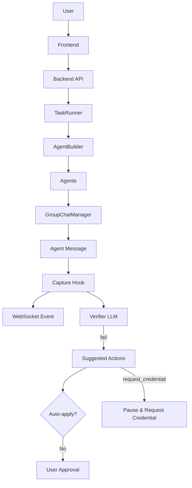

# AutoGen Multi-Agent Runner

A complete multi-agent system orchestrated with AutoGen, featuring a Verifier LLM (OpenRouter) and an interactive Credential Manager.

## Features

*   **Task Runner**: Executes AutoGen agents in background threads.
*   **Verifier LLM**: Inspects every agent message for correctness and relevance.
*   **Dynamic Credential Management**: Pauses execution when an API key is missing; the frontend prompts the user, and execution resumes automatically.
*   **WebSocket Interface**: Real-time streaming of messages, verifier results, and credential requests.
*   **Dockerized**: Complete setup with Docker Compose.

## Directory Structure

```
/
├─ backend/       # FastAPI + AutoGen + Runner
├─ frontend/      # React + Vite
├─ tests/         # Pytest tests
├─ docker-compose.yml
└─ README.md
```

## Quick Start (Docker)

1.  **Configure Environment**:
    ```bash
    cp .env.example .env
    # Edit .env to set SERVER_SECRET_KEY and optionally OPENROUTER_API_KEY
    ```

2.  **Run with Docker Compose**:
    ```bash
    docker-compose up --build -d
    ```

3.  **Access**:
    *   Frontend: http://localhost:5173 (or http://localhost if using nginx build)
    *   Backend API: http://localhost:8000/docs

## Development Setup (Local)

### Backend

1.  Navigate to `backend/`:
    ```bash
    cd backend
    ```
2.  Install dependencies:
    ```bash
    pip install -r requirements.txt
    ```
    *Note: If `pyautogen` causes issues, ensure you have a C++ compiler installed or try `pip install pyautogen` manually.*

3.  Run Server:
    ```bash
    uvicorn app.main:app --reload --port 8000
    ```

### Frontend

1.  Navigate to `frontend/`:
    ```bash
    cd frontend
    ```
2.  Install dependencies:
    ```bash
    npm install
    ```
3.  Run Dev Server:
    ```bash
    npm run dev
    ```
4.  Open http://localhost:5173.

## Testing

Run unit tests from the project root:

```bash
export PYTHONPATH=$PYTHONPATH:$(pwd)/backend
pytest tests/
```

## Architecture

### Overview Flow



### Credential Request Flow

1.  Agent or Verifier emits `request_credential:provider:reason`.
2.  Runner pauses thread and waits on `CredentialStore.wait_for`.
3.  Frontend receives WebSocket event `credential_request`.
4.  User enters key in Modal/Settings.
5.  Frontend POSTs to `/credentials`.
6.  `CredentialStore` encrypts key and signals event.
7.  Runner resumes execution.

## API & WebSocket

### Endpoints

*   `POST /start-task`: `{task: str, ...}` -> `{task_id, ws_url}`
*   `POST /credentials`: `{user_id, provider, value}`
*   `GET /credentials/{user_id}`: List available providers.

### WebSocket Events

*   `agent_message`: `{sender, recipient, content, ts}`
*   `verifier_result`: `{verdict, reason, suggested_actions}`
*   `credential_request`: `{provider, description, request_id}`
*   `action_result`: `{action, detail}`
*   `info` / `error` / `finished`

## Security Notes

*   **Credentials**: Stored in-memory using Fernet encryption. Keys are lost on restart unless you implement persistence (e.g., to DB/File).
*   **Production**: Replace `CredentialStore` with HashiCorp Vault or AWS Secrets Manager. Set `SERVER_SECRET_KEY` securely.
*   **HTTPS**: Ensure Frontend communicates with Backend over HTTPS in production to protect credential transmission.

## Troubleshooting

*   **AutoGen Import Error**: If `import autogen` fails, ensure `pyautogen` is installed (`pip install pyautogen`). The code handles the import gracefully but agents won't run.
*   **Docker Ports**: If port 8000 or 5173 is in use, modify `docker-compose.yml`.
